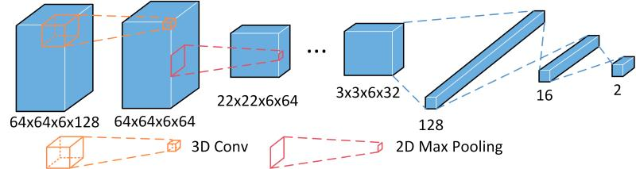

# UT-AnLay #
- This repository is the implementation of Analog Placement Quality Prediction.
> Towards Predicting the Art of Analog Layout: Placement Quality Prediction via Transfer Learning \
Mingjie Liu<sup>*</sup>, Keren Zhu<sup>*</sup>, Jiaqi Gu, Linxiao Shen, Xiyuan Tang, Nan Sun, David Z. Pan \
2020 Design, Automation Test in Europe Conference Exhibition (DATE)



### Requirements ###
This code has been tested under Python 2.7.13. Please install the dependancies first:
```
pip install -r requirements.txt
```

### Data Generation ###
Layouts are generated with [MAGICAL](https://github.com/magical-eda/MAGICAL). \
The analytical analog placement optimizes the weighted wirelength and layout area. 
Different net weighting would result in different placement solutions and post layout performance results. \
For more information on the circuits and layout generation go under [benchmark](./benchmark).

### Placement Feature Extraction ###
Placement results are represented into 2D images and device type and locations are embedded into different image channels according to the circuit topology.
For more details go under [extract_place](./extract_place).

### Data Preparation ###
The initial placement images and labeled performance are stored in hdf5 format under [data](./data). \
To embed coordinate channels, run:
```
python prepare_dataset.py
```
If you would like to explore the dataset with different performance metrics and labeling percentiles, you can customize the script extract_feature.py. 
Remove ./data/data.hdf5 and run the script:
```
source extract.sh
```
Also see [compress_dataset](./compress_dataset) for details.

### CNN Models ### 
Details on the CNN models are under [cnn](./cnn). 
The [models](./models) is the implementaion of training and testing in tensorflow. 
Although feat_3D demonstrate the best ability to generalize, feat_2D is easier to train with only minor performance degradations. 
The pretrained model weights are stored under [weights](./weights). \
See for more details on how these are generated.

### Model Training and Transfer Learning with Finetune ###
For options on training, run:
```
python train.py --help
```
For transfer learning with the pretrained model on other dataset, the following demonstrates an example:
```
python train.py --design OTA2 --finetune --alpha 0.1 --load_weights ./weights/OTA1_feat2D_pretrain.ckpt
```
Make sure you have the correct pretraining weights loaded.

