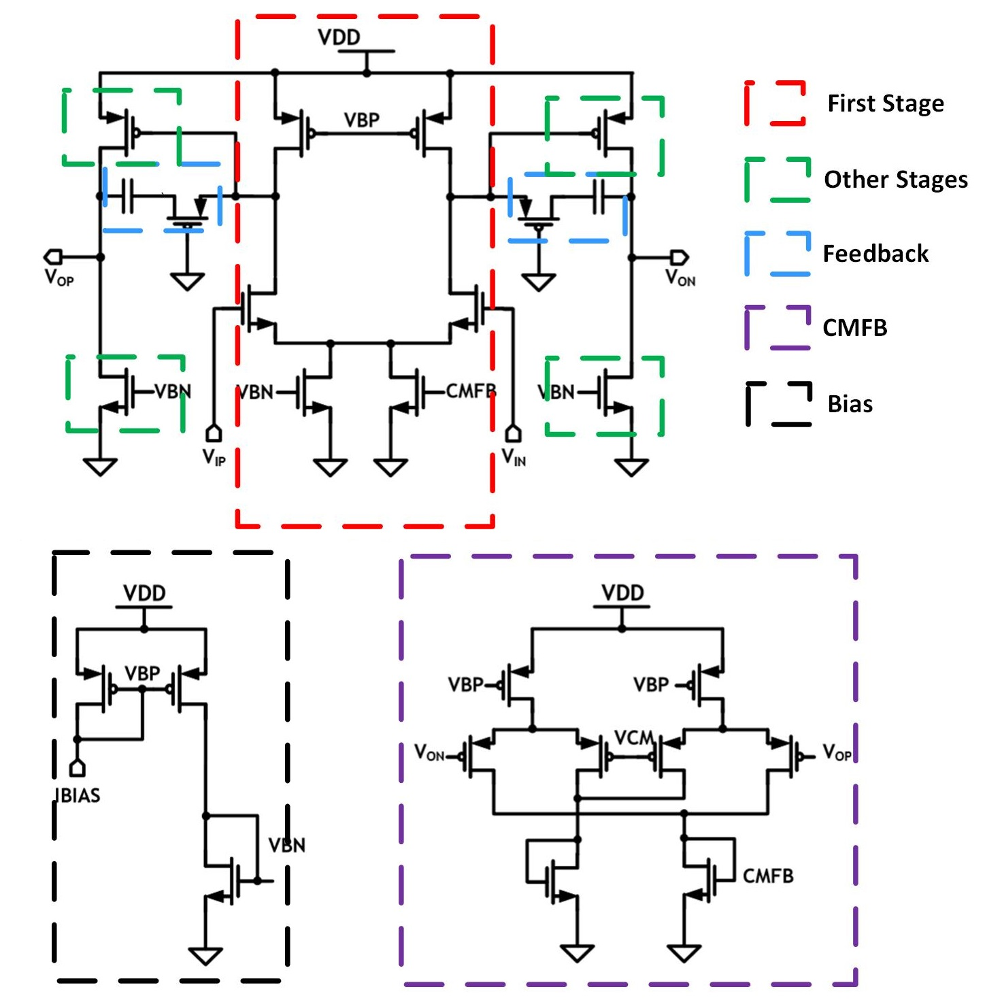

# Feature Extraction #
This folder contains two json files neede for the feature extraction stage. Our proposed feature extraction is design dependent and currently manually labeled.

### Device Type ###
The .json file contains the device type of the correspoinding devices. This information could be automatically obtained from the circuit netlist. \
Current supported devices are classified into the following categories: NMOS, PMOS, CAP, RES. Device type information are embedded in the image as intensity:

| Device Type     | NMOS | PMOS | CAP  | RES  |
|:---------------:|:----:|:----:|:----:|:----:|
| Image Intensity | 0.25 | 0.50 | 0.75 | 1.00 |

### Device Channel ###
The .channel file contain the device channel. This is manually labeled based on the circuit schematic and subcircuits. Currently the labeling methodology is only for OTA circuits.

- Channel 1: Devices in the first amplifier stage. This includes differential input, load and tail bias transistors.
- Channel 2: Devices in other (second or third) amplifier stages.
- Channel 3: Passive device elements in the compensention feedback loop, such as miller capacitance or cmos resistors (zero compensation) etc.
- Channel 4: Devices in the common-mode feedback circuits.
- Channel 5: Devices in the bias circuit current mirrors.

Below shows an example of how device elements are classified into the channels for OTA3.

