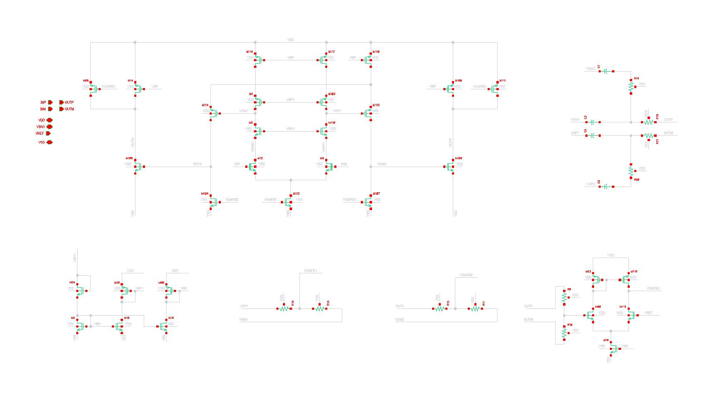
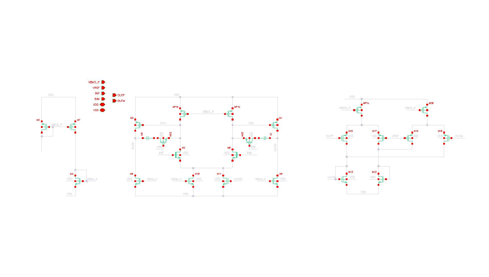
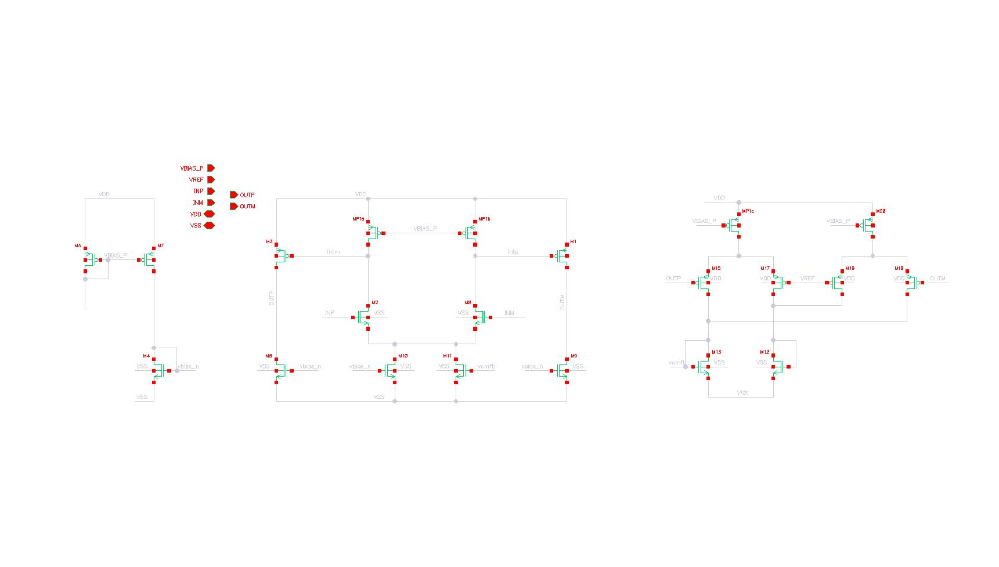

# Circuit Netlists #
The table below summerizes the circuits:
| Design  | Name | Compensation| Stages | CMFB | 
|:---: | :---: | :---: |:---: | :---: |
| OTA1  | Telescopic_Three_stage  | Nested Miller | 3 | Yes |
| OTA2  | Telescopic_Three_stage_1  | Nested Miller | 3 | Yes |
| OTA3 | Core_test_flow | Miller | 2 | Yes |
| OTA4 | Core_FF | None | 2 | Yes|
### OTA1 and OTA2 ###
OTA1 and OTA2 share the same schematic but different sizing. The circuits are sized by different circuit designers with targeting roughly similar performance.

### OTA3 ###

### OTA4 ###

