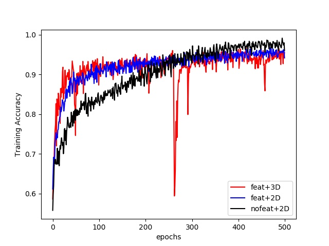
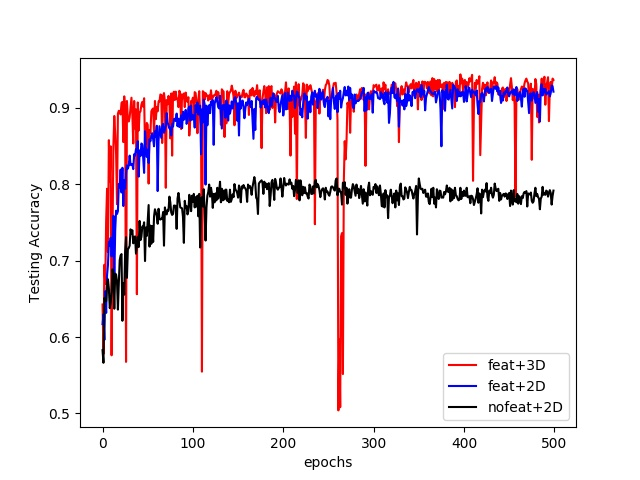

### CNN Models ###
Four models are defined in tensorflow:
- nofeat_2D: 2D convolution layers, without feature extraction.
- nofeat_3D: 3D convolution layers, without feature extraction.
- feat_2D: 2D convolution layers, with feature extraction and coordinate channel encodings.
- feat_3D: 3D convolution layers, with feature extraction and coordinate channel encodings.

